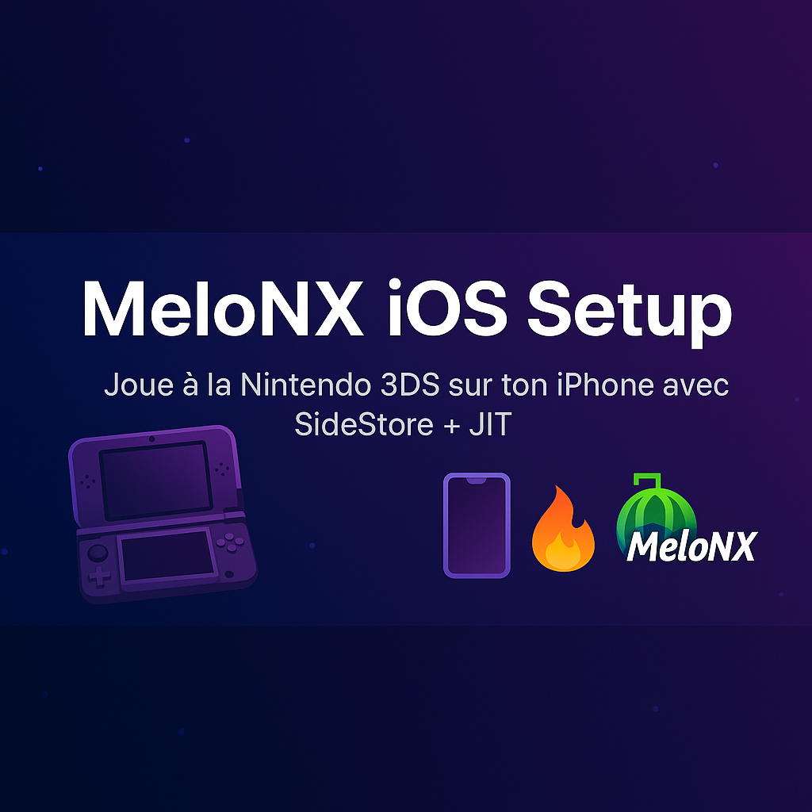

---

# 📱 Installer MeloNX sur iPhone (100 % fonctionnel, sans JIT)

Un guide ultra simple pour installer l’émulateur **MeloNX** sur iOS avec SideStore, sans configuration complexe et sans besoin de JIT à chaque lancement.

---

## 🔧 Étapes à suivre

### 0. Prérequis : Installer SideStore  
👉 De nombreux tutoriels sont disponibles sur YouTube.  
🔗 [Site officiel de SideStore](https://sideloaded.store)

---

### 1. Installer MeloNX via SideStore  
- Ouvre SideStore sur ton iPhone  
- Installe `MeloNX.ipa`

---

### 2. Lancer MeloNX une première fois  
- Ouvre l'app une première fois  
⚠️ **Les fichiers nécessaires ne sont pas inclus.**  
👉 À vous de les récupérer (firmwares, etc.)

---

### 3. Installer **Get More RAM** via SideStore  
- Installe `GetMoreRAM.ipa`  
- Ouvre l'app  
- Connecte-toi avec ton compte iCloud  
- Clique sur **Refresh**, trouve **MeloNX**, puis clique sur le bouton bleu pour appliquer le patch  
- Retourne dans SideStore  
  - Décoche **MeloNX**
  - Puis recoche-le juste après

---

### 4. (Optionnel) Supprimer Get More RAM  
- Tu peux maintenant supprimer l’app pour libérer une place dans SideStore

---

### 5. Lancer StickDeBeug (depuis l'App Store)  
- Ouvre StickDeBeug  
- Insère ton **pairing file**  
- Lance **MeloNX** depuis StickDeBeug  
✅ **Le JIT est activé ainsi que la mémoire étendue.**

> 💡 **Astuce :** Tu peux aussi lancer MeloNX directement depuis SideStore.  
> Reste appuyé sur l’icône de MeloNX > clique sur **JIT**.

---

## 👤 Auteur  
**Matthieu80000**
